# 	dogfightZ 	

基于 

​	**Java Swing** 

以及

​	**自主研发**的基于小孔成像原理与图形光栅化的字符3D画面框架 **graphic_Z** 

构建的 **3D空战游戏**

注：dogfight 为军事用语，是指战机近距离接战缠斗，可直接译为“狗斗”。

##### 项目构建：**Maven**

##### 运行环境：Java 8

## DogfightZ 游戏说明

### 启动游戏

1. ##### 使用 “dogfight启动游戏.bat” 或 双击target目录下的jar包 启动游戏，来到菜单界面

   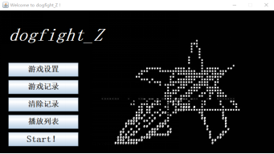

2. ##### 点击Start ! 按钮即可开始游戏，开始游戏后请关闭输入法，使用 [ 和 ]（缩放） 、IJKL（显示尺寸）和MN（字体）键调整画面以适配屏幕

   

   

   #### **游戏试玩预览视频**[**https://www.bilibili.com/video/BV1XU4y1T794**](https://www.bilibili.com/video/BV1XU4y1T794)

### **操作说明：**

##### **战机基本操控（战机起飞前不具有机动能力）**

- W：增加油门值

- A：战机水平左转

- S：减少油门值并使用打开减速板减速

- D：战机水平右转

- 鼠标上下滑动：战机上下翻滚

- 鼠标左右滑动：战机左右翻滚

- 鼠标滚轮：瞄准缩放

- 空格：使用加力燃烧加速飞行

##### **战机战斗操控（刚进入游戏时要等待航炮 CN 和导弹 MS 装弹完成）**

- 鼠标左键：航炮开火

- 鼠标右键：导弹开火

- 鼠标中键：导弹开火并跟随导弹视角（按Q可回到战机视角）

- X：释放诱饵弹

##### **其他键位** 

- F：(按住)查看记分板

- C：切换第一/第三人称视角

- V：切换向前向后看视角

- Q：回到战机视角

- P：暂停/继续

- E：播放上一首音乐

- R：播放下一首音乐

- [ 、]：调整画面缩放比例

- J、K、L、I：改变分辨率

- M、N：切换显示的字体

- Esc：退出游戏

 

#### **武器系统说明**

- **航炮 CAN** 可连续发射无制导的炮弹，单发炮弹伤害较导弹低但连续发射时火力密度高。开火时需要注意提前量，适合打击视区内近距离目标。

- **导弹 MIS** 发射前需要先锁定敌机：使用火控雷达照射敌机（将敌机标识保持在准星附近）即可开始锁定，锁定过程需要2s，锁定后会显示LOCKD（如下图）

  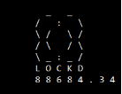

  此时发射导弹，导弹将自动跟踪敌机。导弹伤害较高，摧毁一架敌机一般需要2～3枚导弹（一次装填4枚），适合打击视线范围外的目标。需要注意的是，开始锁定敌机时，敌机能够感受到被锁定，并释放多个诱饵弹干扰锁定，需要等待干扰弹脱离火控雷达照射范围后才能正常锁定敌机。导弹和诱饵弹的装填时间一致。

- **诱饵弹 Decoy** 可以短暂干扰敌机锁定。战机被敌机尝试锁定时，屏幕右侧会出现锁定告警标志并闪烁（闪烁时间逐渐加快），如下图：

  

  此时应按 **X键** 释放诱饵弹干扰敌机锁定，并做机动动作，摆脱敌机追踪，否则如果该标志变为下图所示，即表明敌导弹已经发射，只能尝试做大幅度机动动作摆脱攻击：

  

  

#### **屏幕颜色闪烁说明**

- 短闪红：受到航炮攻击

- 长闪红：受到导弹攻击

- 准星变黄：航炮开火

- 背景闪黄：发射的航炮击中敌机

- 背景闪蓝：导弹开火

- 准星闪蓝：导弹命中敌机

- 当您驾驶战机持续做大幅度机动动作（如大角度转向、打开加力燃烧）时，由于人体对加速度G值的承受能力有限，视力会受到影响，您将会屏幕亮度将会降低、变红，如图所示

  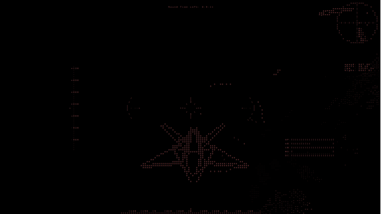

  此时只需停止做大幅度机动动作，即可逐渐恢复视觉

  

## 项目源代码介绍

这是Eclipse-Maven Java工程，使用JDK1.8

编码工作完成后可使用mavenPackage.bat进行maven打包，目标位于target/dogfightZ-jar-with-dependencies.jar

dogfightZ-jar-with-dependencies.jar是独立的可执行游戏本体，在正确安装配置Java环境的计算机上可以直接双击运行。

 

#### 项目结构预览

项目源代码总体分为4个大包，如图所示

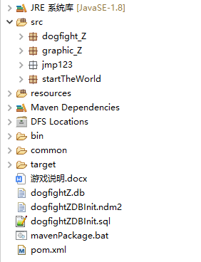

- jmp123 是引入的外部开源（GPLv3）项目，仅用于解码播放MP3 BGM

- graphic_Z 是3D游戏字符画面实现框架，提供核心的图形算法和3D世界内各个元素角色的抽象

- dogfight_Z 是基于graphic_Z框架开发的3D空战游戏

- startTheWorld 内有用于配置和启动游戏的GUI界面

**我将重点介绍 graphic_Z 包和dogfight_Z 内的内容。**

### **graphic_Z包**

graphic_Z 是自主研发的基于小孔成像原理与图形光栅化的字符3D画面框架

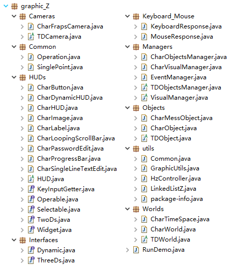

- **Cameras包**提供3D镜头类，其中包含了最核心的3D算法

- **Common包**内为杂项

- **HUDs包**提供叠加在画面之上显示的2D图形元素（例如静态HUD、动态HUD、2D字符控件等）

- **Interfaces包**中为3D物体和动态物体的接口

- **Keyboard_Mouse包**中是适用于Java Swing键鼠捕获的Listener类

- **Worlds包**中提供3D世界类（TDWorld）以及其派生的字符世界（CharWorld）和字符时空（CharTimeSpace）来抽象表示游戏世界

- **Managers包**内提供几个管理器，可分为物体管理器、视觉管理器、事件管理器，它们管理和驱动着整个游戏世界的运转

- **Objects包**内为3D游戏世界中的物体的基类

- **utils包**内包含一些工具类，GraphicUtils类提供一些2D图形元素绘制以及使用静态缓冲进行加速近似计算数学函数的方法，大大提高了游戏运行的性能。LinkedListZ为自主实现的链表，可以提供不易失效的迭代器和更细的控制粒度。HzController是用来控制刷新率的类。

### **dogfight_Z包内容**

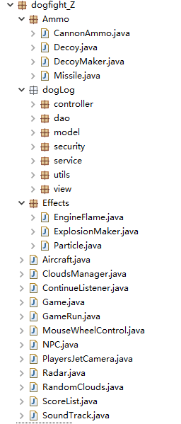

- **Ammo包**内为战机可以发射的弹药，有机炮炮弹（CannonAmmo）、诱饵弹（Decoy）、导弹（Missile）

- **dogLog包**内为一个以MVC方法设计的个人登录和游戏设置、游戏记录查看等的子系统，但暂未完成和投入使用。完成之后将全面取代最外层startTheWorld包内的配置启动器

- **Effects包**内包含游戏中使用的一些粒子效果，如引擎拖烟粒子EngineFlame（用于导弹尾部）、爆炸效果产生器（ExplosionMaker），Particle是具有重力作用效果的小粒子

- **Aircraft**是飞行器类，是玩家、NPC以及导弹的基类

- **CloudsManager**管理RandomColuds（随机云景）的生成、重置

- **ContinueListener**可帮助实现游戏暂停和继续的功能

- **Game**为游戏主类，其中包含游戏主循环逻辑

- **GameRun**是启动游戏的代理类

- **MouseWheelControl**类提供使用鼠标滚轮控制的功能

- **NPC**在Aircraft类基础上增加了自主控制的算法

- **PlayersJetCamera**在字符帧镜头（CharFrapsCamera）的基础上增加了火控雷达功能，可提供敌我识别和搜寻选择锁定敌战机的功能

- **Radar**类是基于动态HUD（CharDynamicHUD）实现的敌我搜寻雷达，可以自我为中心，不断搜寻附近的敌机和友机，并将相对位置显示在雷达界面中，如图所示，@字符代表的是敌机（后期版本改为X），o字符代表友机，玩家自己位于中心

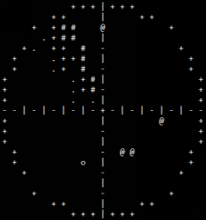

- **ScoreList**是记分板类，基于CharDynamicHUD

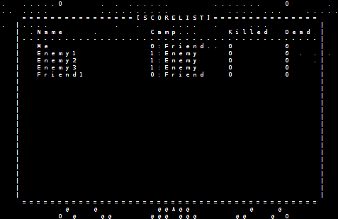

- **SoundTrack**类为BGM播放列表类，载入播放列表，可在游戏运行中切换歌曲，并使用JMP123库解码播放。

## 算法过程与部分实现代码

### **小孔成像算法**

3D游戏与2D游戏最大的不同点在于多了一个纵深的空间轴向，同样大小的物体在距离视角不同距离的位置上会形成大小不同的像，小孔成像原理反应了这种纵深距离与尺寸的对应关系，如下图所示

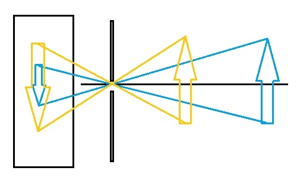 

小孔之所以能成像是因为光屏上的每一点都只能通过小孔接收到一个方向传来的光，所以光屏上每一点都是外部某个确定点的映射。相反如果开孔过大，物体上的一个点发出的光会在光屏上的一片区域形成光斑，如下如所示，如果有多个这样的光斑叠加在一起，必定会是模糊一片，所以只有小孔能够成像

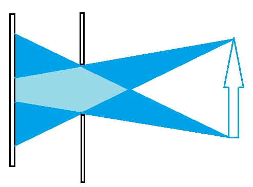 

 

由于小孔成像成的是倒像，于是我们将光屏以小孔为中心作对称，让物体发出的光都会会聚到光屏后的一点，这样就简化了计算如图所示

 

X0、Y0、Z0在通过算法前分别为物体上每个点与镜头形成的相对位置，通过算法后，X0和Y0就是这个点在屏幕上的坐标

**/src/graphic_Z/Cameras/CharFrapsCamera.java**

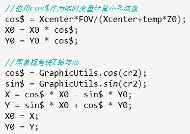 

由于游戏世界中每个物体可以自由移动、转动，而玩家的视野也会跟随玩家自由移动、转动，故，故每个角色元素都有自己在游戏世界中的坐标位置、旋转角度，而每个物体上的每个点都有相对于自己中心的旋转角度和旋转后的位置，再者，玩家镜头也有自己在世界中的坐标和自由转动的角度，要实现小孔程序，就要在这几个不同的坐标系之间进行转换，才能得到每个点相对于镜头的坐标。算法如下（这些代码位于小孔成像之前）

**/src/graphic_Z/Cameras/CharFrapsCamera.java**

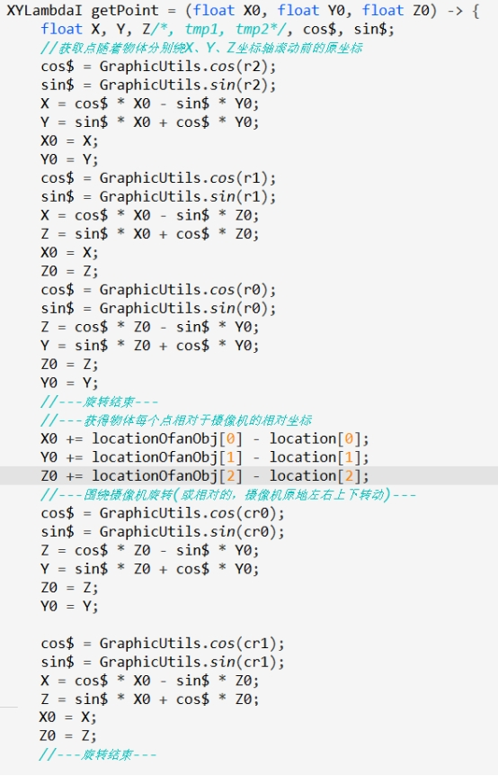 

有了以上基础，我们计算出了物体每一个点在屏幕上的位置坐标，我们需要有一个“感光底片”来接收“小孔”所成的像。我们使用了一个二维字符数组，首先将所有位置设为空格，然后将有光照到的坐标上设置为白色的字符，这样就形成了**一帧**的图像，这个数组称为帧缓冲（fraps_buffer），这属于**图形光栅化**。代码如图所示：

**/src/graphic_Z/Cameras/CharFrapsCamera.java**

 

 

 

为了加速性能，我们知道三维物体经过小孔成像透视变换后，直线仍为直线，所以我们可以采用2维直线绘制算法去绘制物体模型，如图所示：

**/src/graphic_Z/Cameras/CharFrapsCamera.java**

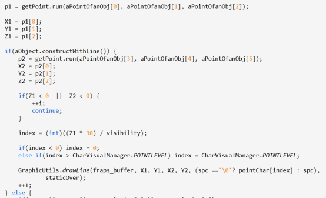 

最后，对于远处的物体，在屏幕上很小，如果绘制每一个顶点，就很浪费性能，所以在以点为基本图形元素绘制物体的过程中，我们采取根据距离不同，跳过绘制部分点的策略，如图（i是物体点的下标，rge为点到镜头的相对距离，visibility为最大能见度）：

**/src/graphic_Z/Cameras/CharFrapsCamera.java**

 

每次刷新，VisualManager会让所有注册的镜头在帧缓冲上对每个物体列表中的每个物体进行曝光（多镜头设计是为了以后进行双眼视差真3D视觉输出（类似于VR设备），左边输出左眼看到的图像，右边输出右眼看到的图像），每个物体曝光后形成的3D画面还需要叠加2D的HUD图形，如下图所示

**/src/graphic_Z/Managers/CharVisualManager.java**

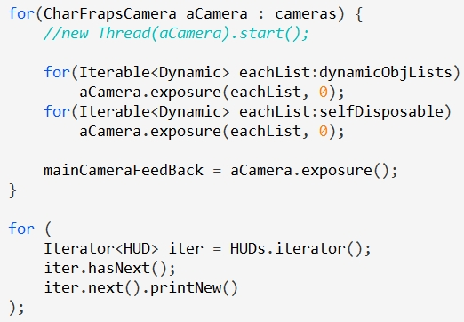 

最后VisualManager将帧缓冲的字符拼接为字符串，刷新到文本框（mainScr）（tmpThread的任务是sleep几十毫秒，来控制屏幕帧率）

**/src/graphic_Z/Managers/CharVisualManager.java**

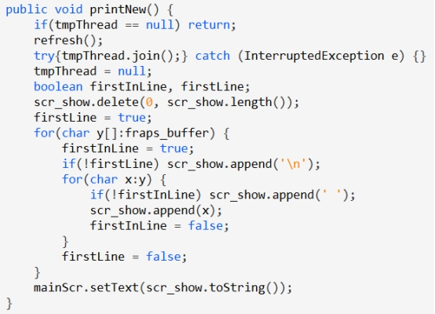 

### 游戏内采用的坐标系

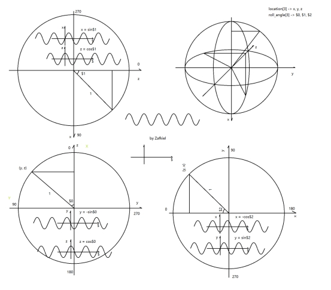

### **静态缓冲加速近似计算数学函数算法**

**主要思想**：将常用的有限定义域数学函数（如三角函数、反三角函数、随机函数等）进行计算静态缓冲，调用函数时，只需要直接去对应的静态数组中取即可，如图是静态表生成的算法，boot为设定的精度值，为65536（即函数定义域划为65536份）

**/src/graphic_Z/utils/GraphicUtils.java**

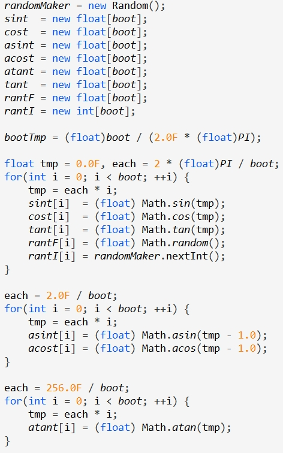 

以下是对应的几个函数值获取方法：

**/src/graphic_Z/utils/GraphicUtils.java**

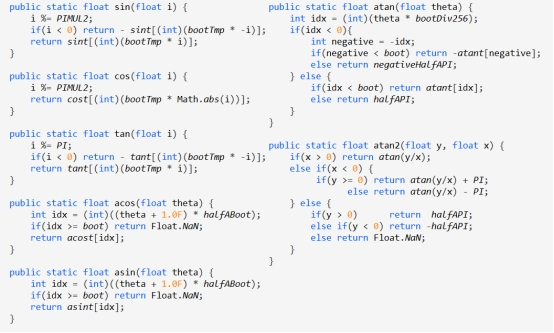 

### **飞行器飞行算法**

在游戏的每一帧中，Game类的主循环调用刷新方法时，会协调ManagerObject去更新每个物体的状态，再让VisualManager去构建新一帧的画面：

**/src/graphic_Z/Worlds/CharTimeSpace.java** (Game类的基类)

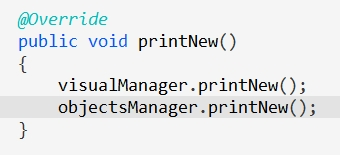 

下图是ObjectsManager的printNew()

**/src/graphic_Z/Manager/CharObjectsManager.java**

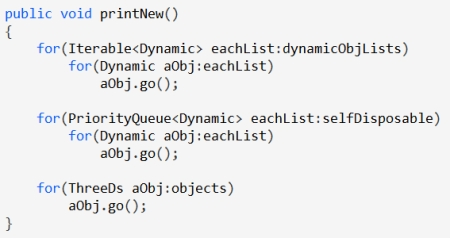 

VisualManager的printNew()就是介绍小孔成像算法最后的那段代码。

ObjectsManager调用每个物体的go()方法，对于飞行器类：

**/src/dogfight_Z/Aircraft.java**

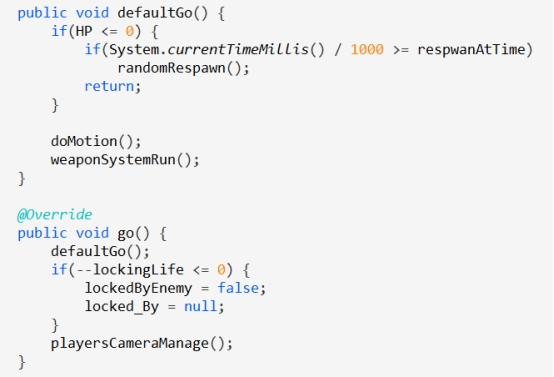 

WeaponSystemRun是武器系统的运行方法，而doMotion()为飞行运动的核心代码，如下图所示

**/src/dogfight_Z/Aircraft.java**

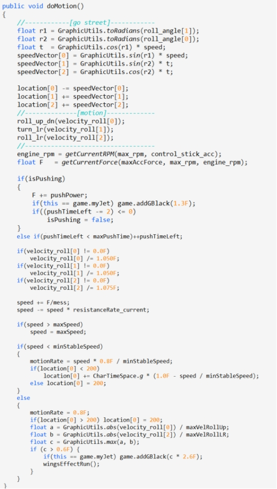 

在执行doMotion算法之前，Game类中主循环接收到用户的击键后，会调用类似于以下方法的代码去改变几个运动状态向量（velocity_roll、roll_angle等）：

**/src/dogfight_Z/Aircraft.java**

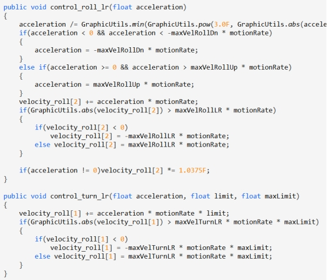 

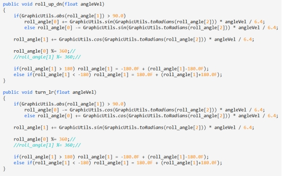 

### **导弹跟踪算法**

核心思想：赋予导弹一只眼睛，以导弹的视角计算目标在其“眼睛”中的位置（CharFrapsCamera.getXY_onCamera），如果偏离中心，就以飞行器基类的方法操控转向，直至飞向目标

**/src/dogfight_Z/Ammo/Missile.java**

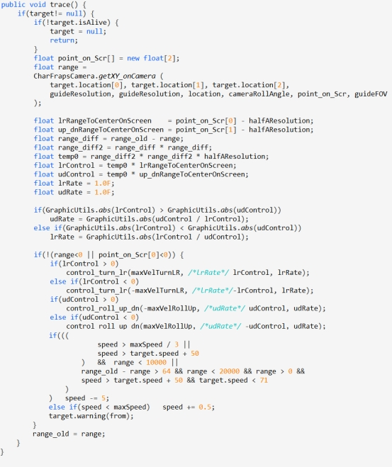 

### **NPC算法**

NPC主要有两种状态：1.巡航状态，2.追踪并攻击以及逃离攻击

巡航算法就是随机地选取方向，每次选取方向后保持随机的时间飞行。如下图：

**/src/dogfight_Z/NPC.java**

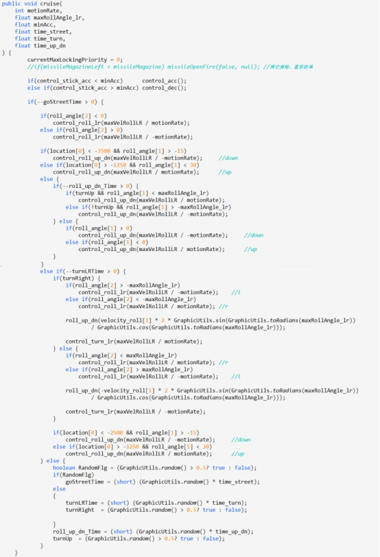 

NPC追踪玩家攻击的算法与导弹追踪目标的算法很类似，在其基础上增加了火控锁定和武器控制，代码比较冗长，暂不张贴于此，详见NPC类中的trace()和pursuit(float range_to_me)算法。

## 项目打包说明

请运行 **mavenPackage.bat**，打包后位于 **target/dogfightZ-jar-with-dependencies.jar**，包含依赖项，可在JRE1.8环境下独立运行，若正确配置JAVA_HOME，双击该jar包即可启动游戏。